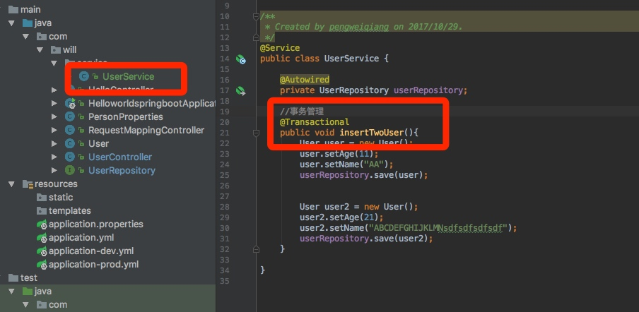

# Spring Boot入门级
### Spring Boot特点
	1.简化配置
	2.备受关注，是下一代框架
	3.微服务的入门级微框架

### Spring Boot Hello World

***
#### 1.创建一个SpringBoot程序
* step1：选择Spring Initializer		
* step2：填写项目信息

* step3：选择Web，创建Web项目



	**启动项目的方式**
	1. Main方法启动：前提是在标有`@SpringBootApplication`类中。
	2. Maven命令行启动：切换到项目的目录。使用 `mvn spring-boot:run` 启动
	3. Java命令行启动：先切换在项目目录，使用`mvn install`进行编译，进入target目录，最后使用`java -jar 文件名`命令启动

	***

### 2.项目属性配置

* **配置文件方式**

	1. application.properties：
		

	2. **application.yml**（推荐使用）：
	


* **获取配置参数**
	
```
@Value("${name}")
private String name ;//获取application.yml中name单个参数
@Value("${age}")
private Integer age;  
@Value("${content}")
private String content;  
@Autowired  
private PersonProperties personProperties;//获取application.yml中person对象参数
```
上述`PersonProperties`必须要加上`@Component`和`@ConfigurationProperties(prefix = "person")`注解

* **多环境配置**  
	主要用来解决开发环境、正式环境等各种环境配置。
	
 1. 手动更改环境：在application.yml中切换`active`属性。（dev|prod）
 2. 使用Java命令进行更改：首先`mvn install`进行编译，然后使用`java -jar target/项目.jar --spring.profiles.active=prod`
	

#### 3.Controller的使用

注解方式 | 作用  |  示例
------- | ------- | -------
@Controller | 处理http请求 |
@RestController | Spring4之后新加的注解，原来返回json需要@ResponseBody配合@Controller |
@RequestMapping | 配置url映射 | @RequestMapping(value = {"/hello","/hi"},method = RequestMethod.GET)

* 获取请求参数
	* @PathVariable：获取url中的数据
	
	```
@RequestMapping(value="/login/{userName}/{password}",method = RequestMethod.GET)  

public String login(@PathVariable("userName")String   
userName,@PathVariable("password")String password){  

    return userName+"  "+password;  
    
}

	```
	* @RequestParam：获取请求参数的值
		
	```
	@RequestMapping(value="/login2",method = RequestMethod.GET)  
	
public String login2(@RequestParam(value = "userName",required = false,defaultValue = "")  String userName,  
	 @RequestParam("password")String password){  
	 
    return userName+"  "+password;  
	 }
	```
	* @GetMapping：组合注解。简化
	
	```
	@GetMapping("/login")
	@PostMaping("/login")
	...
	```
	
#### 4.Spring-data-jpa
	
**定义**：JPA(Java Persistence API)定义了一系列对象持久化的标准，目前实现这一规范的产品有Hibernate、Toplink等。

1. step1：在maven中Pom.xml中添加mysql和spring-boot-jpa依赖

	
	```
	<!--数据库-->
	
 <dependency>  
	
	<groupId>mysql</groupId>
		
	<artifactId>mysql-connector-java</artifactId>
	</dependency>
	
<!--spring-boot-jpa-->
	
<dependency>
	
	<groupId>org.springframework.boot</groupId>
		
	<artifactId>spring-boot-starter-data-jpa</artifactId>	
	</dependency>

	```

2. step2：添加数据库配置地址、jpa配置

	````
	spring:  
	
  profiles:  
  
    active: dev   #多环境配置选择  
    
  datasource:  
  
    driver-class-name: com.mysql.jdbc.Driver  
    
    url: jdbc:mysql://127.0.0.1/will  
    
    username: root  
    
    password: 123456  
    
  jpa:  
  
    hibernate:  
    
      ddl-auto: create #运行的时候会自动创建表，即使已经存在该表   		update 
      
    show-sql: true #控制台看见sql语句  
  

	````
3. step3：对象映射具体表
	


#### 5.事务管理


