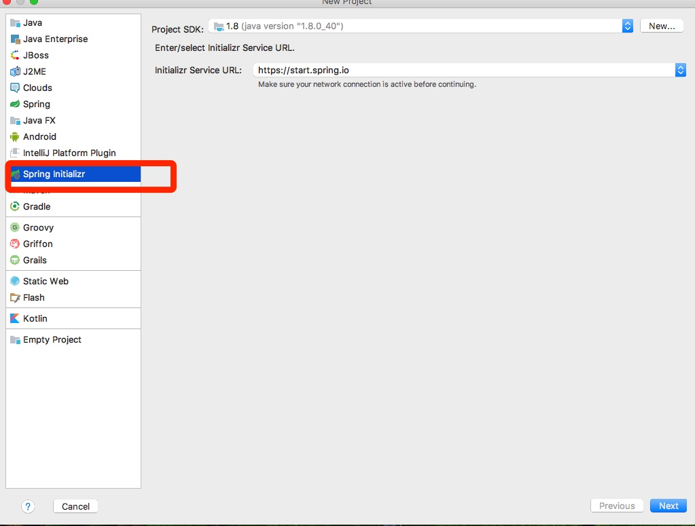
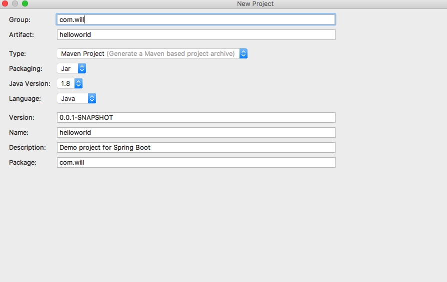
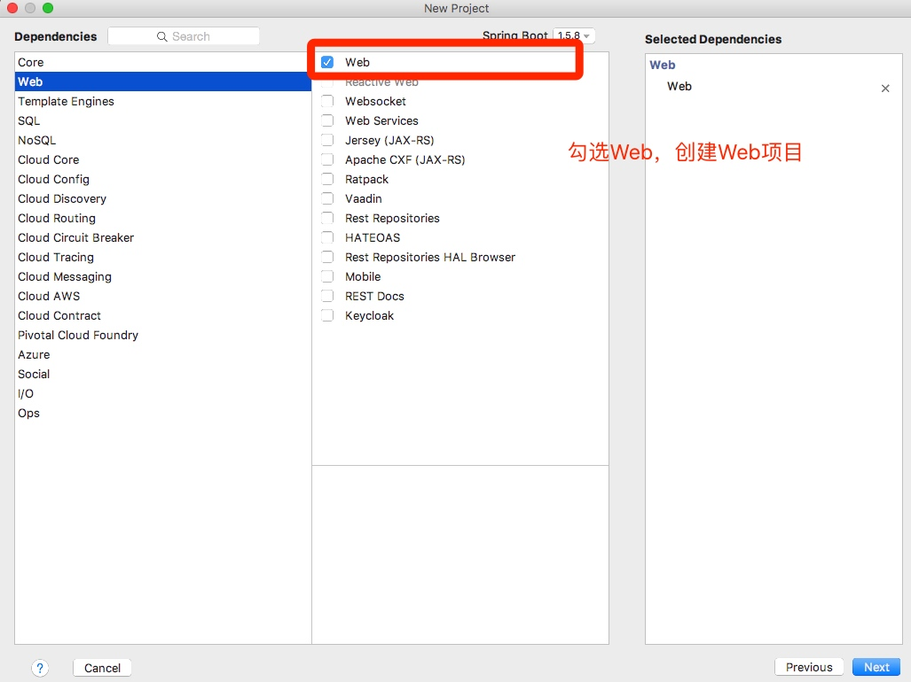
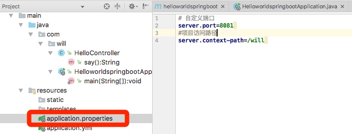
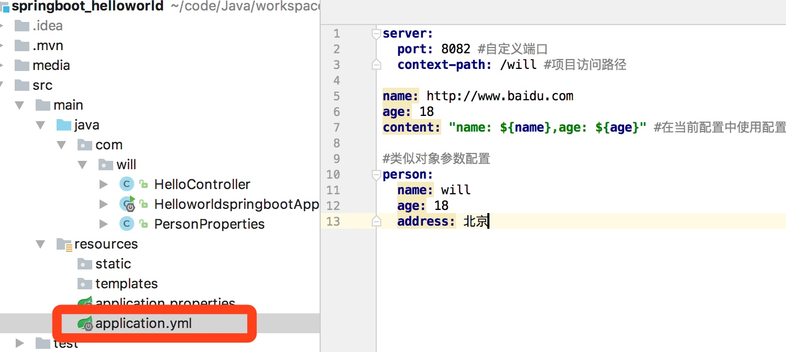
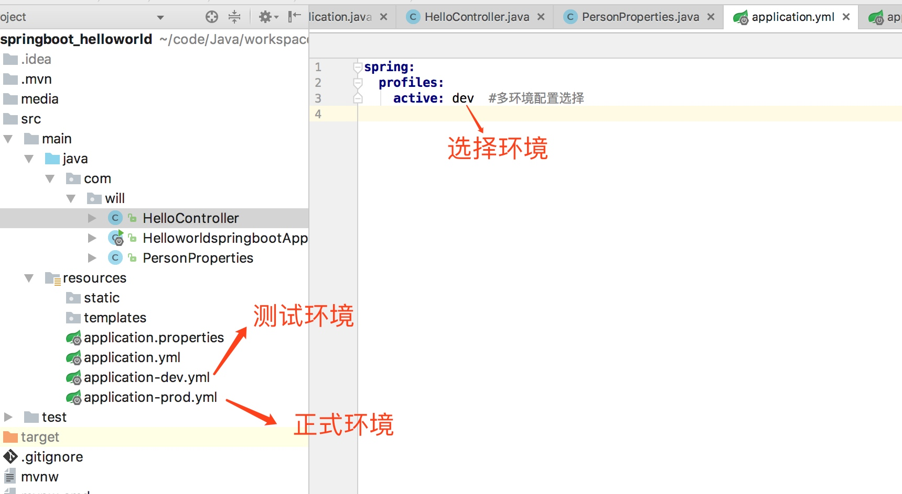

# Spring Boot入门级
###Spring Boot特点
	1.简化配置
	2.备受关注，是下一代框架
	3.微服务的入门级微框架

### Spring Boot Hello World

***
#### 1.创建一个SpringBoot程序
* step1：选择Spring Initializer		
* step2：填写项目信息

* step3：选择Web，创建Web项目



	**启动项目的方式**
	1. Main方法启动：前提是在标有`@SpringBootApplication`类中。
	2. Maven命令行启动：切换到项目的目录。使用 `mvn spring-boot:run` 启动
	3. Java命令行启动：先切换在项目目录，使用`mvn install`进行编译，进入target目录，最后使用`java -jar 文件名`命令启动

	***

### 2.项目属性配置

* **配置文件方式**

	1. application.properties：
		

	2. **application.yml**（推荐使用）：
	


* **获取配置参数**
	
```
@Value("${name}")
private String name ;//获取application.yml中name单个参数
@Value("${age}")
private Integer age;  

@Value("${content}")
private String content;  

  

@Autowired  

private PersonProperties personProperties;//获取application.yml中person对象参数
```
上述`PersonProperties`必须要加上`@Component`和`@ConfigurationProperties(prefix = "person")`注解

* **多环境配置**  
	主要用来解决开发环境、正式环境等各种环境配置。
	
 1. 手动更改环境：在application.yml中切换`active`属性。（dev|prod）
 2. 使用Java命令进行更改：首先`mvn install`进行编译，然后使用`java -jar target/项目.jar --spring.profiles.active=prod`
	
