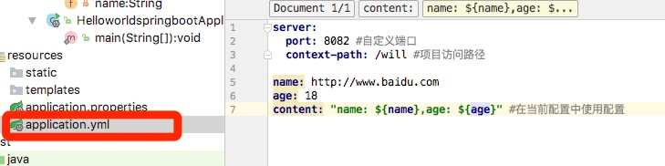

# Spring Boot入门级
### Spring Boot特点
	1.简化配置
	2.备受关注，是下一代框架
	3.微服务的入门级微框架

### Spring Boot Hello World

***
#### 1.创建一个SpringBoot程序

* step1：选择Spring Initializer		
* step2：填写项目信息

* step3：选择Web，创建Web项目



	**启动项目的方式**
	1. Main方法启动：前提是在标有`@SpringBootApplication`类中。
	2. Maven命令行启动：切换到项目的目录。使用 `mvn spring-boot:run` 启动
	3. Java命令行启动：先切换在项目目录，使用`mvn install`进行编译，进入target目录，最后使用`java -jar 文件名`命令启动

	***

### 2.项目属性配置

* **配置文件方式**

	1. application.properties：
		

	2. **application.yml**（推荐使用）：
	

* **获取配置参数**
	
```
@Value("${name}")  
private String name ;//获取application.yml中name参数
@Value("${age}") private Integer age;  
@Value("${content}")
private String content;
```

* ****	

#### 3.Controller的使用

#### 4.Spring-data-jpa

#### 5.事务管理

